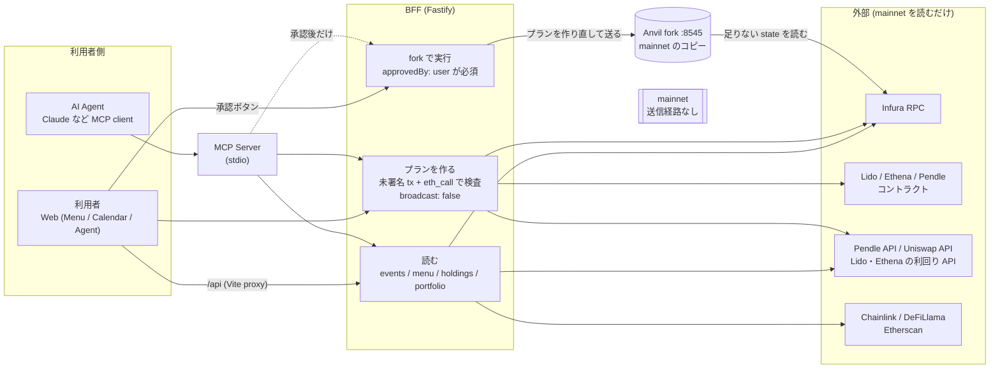
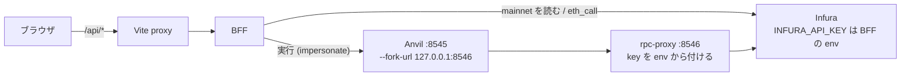
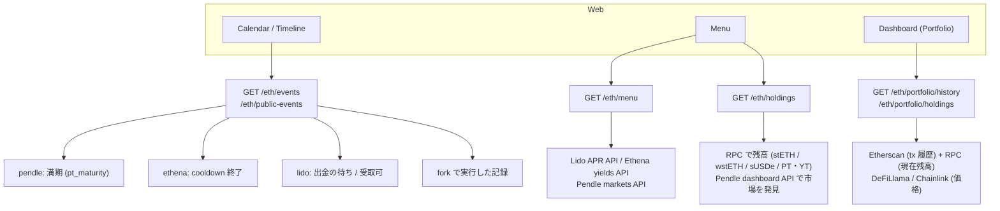
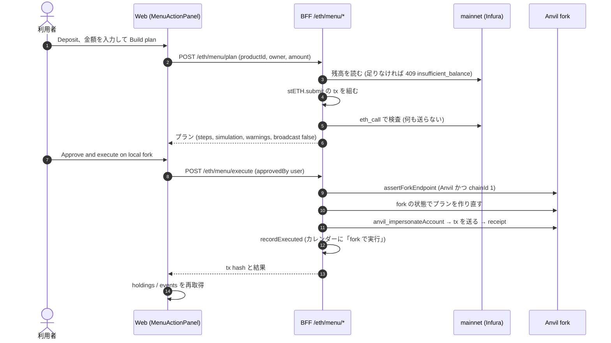
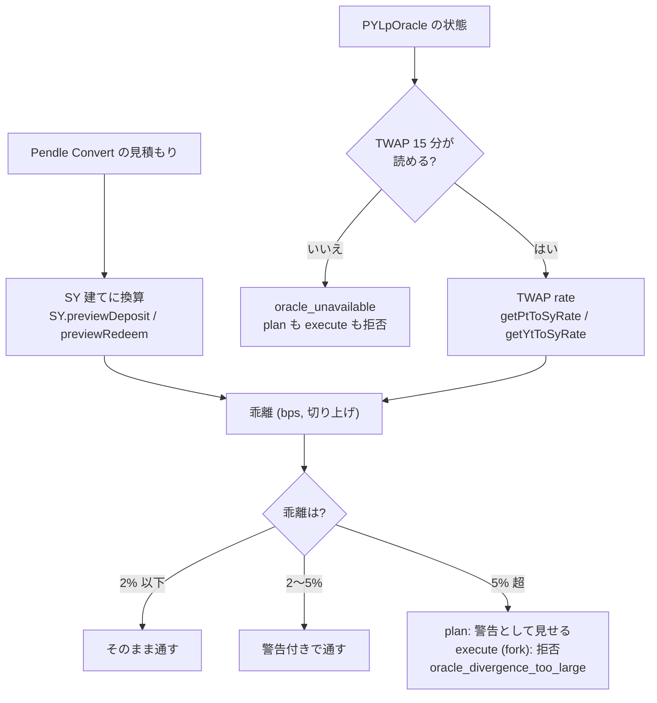
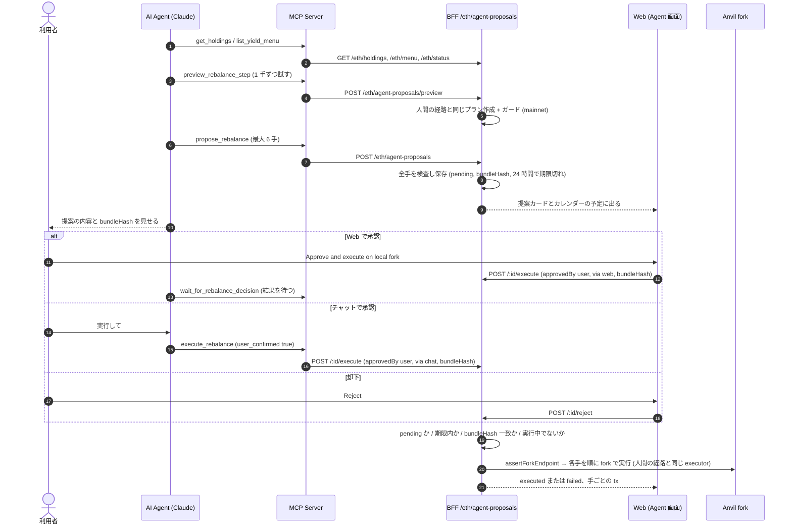
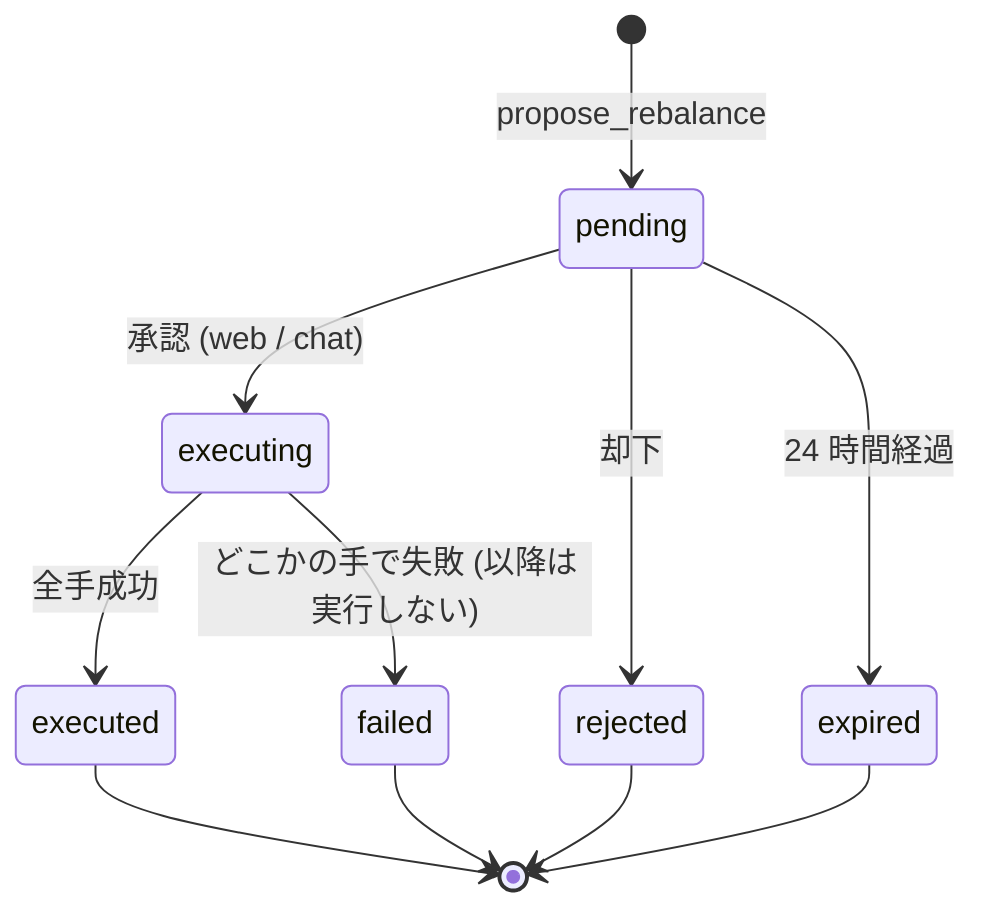

# Ethereum 実行フロー (Web / BFF / プロトコル / AI Agent)

Seasonals が Ethereum で「読む → プランを作る → 承認 → 実行」をどう流しているかの図。
上に全体像、下に詳細を置く。コードと食い違ったら **コードが正**。変更したらこの文書も直す。

- 対象: `artifacts/seasonals-web` (Web)、`artifacts/seasonals-bff` (BFF)、`artifacts/seasonals-mcp-server` (MCP Server)、`scripts/eth-fork.sh`
- 以下のパスは `web/` = `artifacts/seasonals-web/src/`、`bff/` = `artifacts/seasonals-bff/src/` の略
- §5 の AI Agent (リバランス提案) は **開発中** (`eth-agent-proposals` ブランチ、2026-09-26 時点で main 未マージ)

**前提**: 実行先は **ローカルの Anvil fork だけ**。mainnet には送らない。秘密鍵は持たない (fork 上で `anvil_impersonateAccount`)。ブラウザ wallet での署名はまだ繋いでいない。

---

## 0. 全体像

- **読む**: カレンダーの予定、Menu の利回り、保有、資産推移を集める。外部 API は BFF だけが呼ぶ (key はサーバーの env)。
- **プランを作る**: 各プロトコルの tx を組み、mainnet への `eth_call` で通るか確かめて返す。この時点では何も送らない。
- **実行**: 人が承認したときだけ。送り先が Anvil fork であることを確かめ、fork の状態でプランを作り直してから送る。
- AI Agent はアプリの外 (MCP client 側) で動く。アプリ内に LLM は無い。

## 1. RPC の配線と秘密情報

- `bff/ethereum/client.ts`: mainnet は `ETHEREUM_RPC_URL`、無ければ Infura。fork は `ETH_FORK_RPC_URL` (既定 `127.0.0.1:8545`)。
- `scripts/eth-fork.sh` + `scripts/rpc-proxy.mjs`: Anvil の起動引数に key を載せない (プロセス一覧に出ない)。
- `ETH_EXECUTION_TARGET` は既定 `fork`。`mainnet` にすると実行が **止まる** (プランのみ)。
- エラーは `sanitizeError` で key / URL を消してから返す。ブラウザの bundle に key は入らない。

## 2. 読み取り (カレンダー・Menu・保有・資産推移)

| 何を | BFF | 上流 |
|---|---|---|
| Pendle 満期 → `pendle_redeem` | `bff/ethereum/pendle.ts` | Pendle API (markets / dashboard) + RPC |
| Ethena cooldown 終了 → `ethena_unstake` | `bff/ethereum/ethena.ts` | RPC `sUSDe.cooldowns` |
| Lido 出金 → `lido_claim` | `bff/ethereum/lido.ts` | RPC WithdrawalQueue |
| fork で実行した記録 | `bff/ethereum/execute.ts` (`recordExecuted`) | ローカル保存 |
| Menu の利回り | `bff/ethereum/menu.ts` | Lido / Ethena / Pendle の API |
| 保有 | `bff/ethereum/holdings.ts` | RPC (mainnet) + Pendle dashboard |
| 資産推移 | `bff/ethereum/history.ts`, `bff/portfolio/engine.ts` | Etherscan V2, RPC, DeFiLlama, Chainlink |

各 source は `Promise.allSettled` で独立していて、1 つ落ちても他は出る (`bff/ethereum/events.ts`)。

## 3. 人が実行する流れ (例: Menu から Lido に Deposit)

プロトコルごとの違い (流れは上と同じ。変わるのは「tx を組む」部分):

| 操作 | tx の中身 | 追加の検査 | 場所 |
|---|---|---|---|
| Lido Deposit | `stETH.submit` (ETH を送る) | ETH 残高 | `bff/ethereum/menu-actions.ts` `lidoPlan` |
| Lido Withdraw | approve → `requestWithdrawals` / `requestWithdrawalsWstETH` | MIN / MAX で分割 (`splitWithdrawal`) | 同上 |
| Ethena Deposit | approve → `sUSDe.deposit` | USDe 残高 | `ethenaPlan` |
| Ethena Withdraw | `cooldownShares` (期間 0 なら `redeem`) | 進行中の cooldown があれば「やり直しになる」警告 | `ethenaPlan` |
| Pendle PT / YT | Pendle Convert API の router tx (+ approve) | 満期なら拒否、**価格ガード** (§4) | `pendlePlan`, `pendle-guard.ts` |
| USDC → USDe | Uniswap Trading API: approve → Permit2 → swap | USDC⇄USDe のみ、Chainlink で peg ±50bps | `bff/ethereum/uniswap.ts` |
| 予定からの操作 | `lido_claim` / `ethena_unstake` / `pendle_redeem` | 実行時に状態を読み直す | `bff/ethereum/plans.ts` → `POST /eth/execute` |

**USDC しか無いときの Ethena Deposit**: Deposit パネルから Uniswap で USDC→USDe を fork 上で swap し、その後のプランは `state: "fork"` で fork の残高を使って作る (`buildMenuPlanOnFork`)。

**予定からの操作**: カレンダーの詳細 → `POST /eth/build-action` でプラン → `POST /eth/execute`。fork 上では時間を進めないと cooldown 等は終わらない (`/eth/fork/advance` は手動用で UI からは呼ばない)。

## 4. Pendle の価格ガード (oracle fail-closed)

- 閾値は `WARN_BPS = 200` / `BLOCK_BPS = 500`、TWAP は 900 秒 (`bff/ethereum/pendle-guard.ts`)。CLAUDE.md §4 の表と同じ判定。
- ガードは実行時にも mainnet の oracle で測り直す。
- Web は `GET /eth/menu/context` で「満期」「oracle 未準備」を先に表示し、ボタンを出さない。
- USDC⇄USDe の swap は Chainlink の peg (±50bps、古い値は拒否) で同じく fail-closed (`bff/ethereum/pricing.ts`)。

## 5. AI Agent の流れ (開発中: `eth-agent-proposals` ブランチ)

- 実行処理は人間の経路と共通 (`executeMenuOnFork` / `executeUniswapSwapOnFork` / `executeOnFork` / Aqua)。Agent 専用の送信経路は無い。
- `pending` / `executing` の提案はカレンダーに「Agent proposal」として出る。
- BFF 再起動時に `executing` のまま残った提案は `failed` にする (ロックを残さない)。
- 既存の Solana 向け tool (`compare_opportunities` など) と、Ethereum の読み取り用 tool (`list_events` / `get_proposal` / `build_action` / `ship_lp_strategy`) は main にある。

## 6. 安全装置

| 装置 | 内容 | 人の経路 | Agent の経路 |
|---|---|---|---|
| 承認 | 実行 route は `approvedBy: "user"` が無ければ 403 | ✓ | ✓ (+ `via` と `bundleHash` 必須) |
| 内容の固定 | 承認した提案と実行する提案が同じか (`bundleHash`) | ─ | ✓ |
| 送信先 | Anvil かつ chainId 1 でなければ送らない (`assertForkEndpoint`) | ✓ | ✓ |
| mainnet 不送信 | プランは `broadcast: false`。mainnet の signer が存在しない | ✓ | ✓ |
| 価格 | Pendle TWAP ガード / Chainlink peg (取れなければ止める) | ✓ | ✓ (提案時にも検査) |
| 金額 | 最小単位の文字列 → bigint (`lib/utils/numeric.ts`)、0 と不正値は 400 | ✓ | ✓ |
| 残高 | 足りなければ 409 (fork / mainnet のどちらで足りないかを表示) | ✓ | ✓ (2 手目以降は実行時に判定) |
| 作り直し | 実行時は preview を信用せず fork の状態でプランを作り直す | ✓ | ✓ |

## 7. 現状の制約と未実装

- **mainnet での実行・ブラウザ wallet での署名は無い**。実行は fork だけ。
- **Ethereum に `re_deposit` / `rotate` は無い**。満期の操作は `pendle_redeem` だけで、「次の PT に乗り換え」は提案の文面のみ。
- **保有表示は mainnet を読む**。fork で実行しても Menu の保有や Portfolio の数字は変わらない (カレンダーの「fork で実行」記録は出る)。
- **Agent (開発中)**:
  - チャット承認は Agent の申告に頼る。`user_confirmed` は MCP Server の入力検査だけで、execute route に認証は無い。
  - Solana 側の承認 token・`approval_mode` (`manual_only`)・1 日の実行上限は Ethereum の提案には効かない。
  - 途中の手で失敗しても、それまでの手は fork 上に残る (巻き戻さない)。
  - Aqua の手は preview で simulate されず、fork で実行して初めて確かめられる。
  - `amount: "max"` は未対応。Lido / Ethena の出金は申請まで (受け取りはカレンダーの予定から)。
